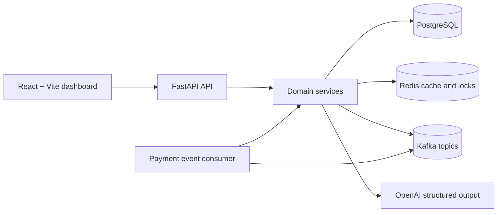
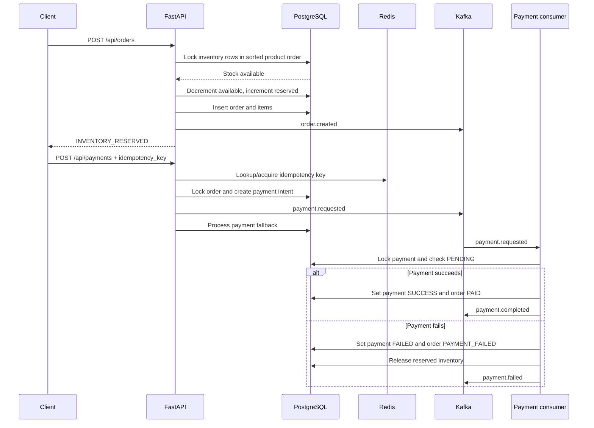

# OrderSystem

Distributed Order & Inventory Management System built as a cloud-ready,
event-driven commerce backend with a React operations dashboard.

The project demonstrates the core reliability problems in an order workflow:
preventing inventory overselling under concurrent requests, making payment
retries safe, coordinating work through events, and recovering inventory when a
downstream payment operation fails.

## Capabilities

- Product catalog management with unique SKU enforcement.
- Inventory creation, lookup, reservation, and release.
- Order creation with server-side pricing from the product catalog.
- PostgreSQL row-level locking with `SELECT ... FOR UPDATE` to serialize
  competing reservations for the same inventory row.
- Deterministic product lock ordering for multi-item orders to reduce deadlock
  risk.
- Idempotent payment creation using a unique idempotency key, Redis cache/lock,
  and a database constraint as the final authority.
- Payment state transitions for successful and failed payments.
- Compensating inventory release when payment processing fails.
- Kafka event contracts and a background consumer for payment processing.
- Graceful local development when Redis or Kafka is unavailable: PostgreSQL
  remains the source of truth and payment processing falls back inline.
- OpenAI-powered demo data generation for products and initial inventory.
- React/Vite dashboard for health, products, inventory, orders, manual data
  entry, and AI demo-data generation.
- Automated API and concurrency tests with pytest.

## Architecture



### Backend layers

- `app/main.py`: FastAPI application, CORS, lifespan startup, health checks,
  and router registration.
- `app/api/`: HTTP route handlers for products, inventory, orders, payments,
  and demo data.
- `app/services/`: business rules, transaction boundaries, locking, event
  publication, idempotency, and compensation logic.
- `app/models/`: SQLAlchemy models for products, inventory, orders, order items,
  and payments.
- `app/schemas/`: Pydantic request and response contracts with validation.
- `app/core/`: settings, database session management, and Redis helpers.
- `app/kafka/`: event models, background producer, and payment consumer.

### Frontend

The frontend is a Vite-powered React application in `frontend/`. It polls the
backend health endpoint and refreshes products, inventory, and orders every ten
seconds. It provides:

- PostgreSQL/backend connection status.
- Product, inventory, and order summary metrics.
- Product, inventory, and order tables.
- Manual product creation.
- Manual inventory creation.
- Manual order placement.
- OpenAI demo-data generation for one to twenty products.
- Success and error notifications for API operations.

The frontend currently uses `http://localhost:8000` as its API base URL and is
served by Vite at `http://localhost:5173` during development.

## Project Structure

```text
OrderSystem/
├── app/
│   ├── main.py                 # FastAPI application and lifecycle
│   ├── api/                    # HTTP route modules
│   ├── core/                   # Settings, database, Redis helpers
│   ├── kafka/                  # Events, producer, and consumer
│   ├── models/                 # SQLAlchemy persistence models
│   ├── schemas/                # Pydantic API contracts
│   └── services/               # Domain and workflow logic
├── frontend/
│   ├── src/App.jsx             # Operations dashboard
│   ├── src/App.css             # Dashboard styles
│   ├── src/index.css           # Global styles
│   ├── package.json             # Frontend scripts/dependencies
│   └── vite.config.js           # Vite configuration
├── tests/                      # API, validation, payment, and concurrency tests
├── .env.example                # Safe local configuration template
├── pyproject.toml               # Python dependencies and project metadata
├── uv.lock                      # Locked Python dependency versions
└── README.md
```

## Requirements

### Required

- Python 3.13 or newer.
- PostgreSQL 12 or newer, available through `DATABASE_URL`.
- [uv](https://docs.astral.sh/uv/) for Python dependency management.

### Optional but supported

- Redis for faster idempotency lookups and distributed payment-intent locks.
- Kafka for asynchronous order and payment events.
- Node.js and npm for the React frontend.
- An OpenAI API key for `/api/demo/generate`.

Redis and Kafka are optional for local development. When they are unavailable,
the application logs a warning and continues using PostgreSQL-backed behavior.

## Installation

Clone the repository and enter the project directory:

```bash
git clone https://github.com/harshulsingal/OrderSystem.git
cd OrderSystem
```

Install Python dependencies:

```bash
uv sync
```

Create a local environment file from the template:

```bash
cp .env.example .env
```

Update `.env` with a valid PostgreSQL connection string. Never commit `.env`:
it is intentionally ignored by Git.

## Configuration

| Variable | Purpose | Default |
| --- | --- | --- |
| `DATABASE_URL` | SQLAlchemy PostgreSQL connection string | Required |
| `REDIS_HOST` | Redis hostname | `localhost` |
| `REDIS_PORT` | Redis port | `6379` |
| `KAFKA_BOOTSTRAP_SERVERS` | Kafka broker address | `localhost:9092` |
| `OPENAI_API_KEY` | Key for AI demo-data generation | Empty |
| `OPENAI_MODEL` | OpenAI model used for structured demo data | `gpt-5.4-mini` |

Use a currently supported OpenAI model name in `OPENAI_MODEL` when enabling the
demo generator. The application validates and stores generated product data
before committing it to PostgreSQL.

## Running the Backend

Start FastAPI with auto-reload:

```bash
uv run uvicorn app.main:app --reload
```

The backend is available at:

- API root: `http://localhost:8000/`
- Swagger UI: `http://localhost:8000/docs`
- ReDoc: `http://localhost:8000/redoc`
- Database health: `http://localhost:8000/health/db`

The application creates missing tables at startup through SQLAlchemy metadata.
For production deployments, replace this development convenience with a formal
migration workflow such as Alembic.

## Running the Frontend

In a second terminal:

```bash
cd frontend
npm install
npm run dev
```

Open `http://localhost:5173/` in a browser. The backend must be running on
port 8000 for the dashboard to show live data.

Useful frontend commands:

```bash
npm run build       # Production build
npm run preview     # Preview the production build
npm run lint        # Run Oxlint
```

## API Reference

### Health

| Method | Endpoint | Description |
| --- | --- | --- |
| `GET` | `/` | API liveness response |
| `GET` | `/health/db` | Executes `SELECT 1` against PostgreSQL |

### Products

| Method | Endpoint | Description |
| --- | --- | --- |
| `POST` | `/api/products` | Create a product with a unique SKU |
| `GET` | `/api/products` | List products with pagination |
| `GET` | `/api/products/{product_id}` | Retrieve one product |

Example:

```bash
curl -X POST http://localhost:8000/api/products \
  -H 'Content-Type: application/json' \
  -d '{"name":"Keyboard","sku":"KB-001","price":"49.99"}'
```

### Inventory

| Method | Endpoint | Description |
| --- | --- | --- |
| `POST` | `/api/inventory` | Create inventory for a product |
| `GET` | `/api/inventory` | List inventory records |
| `GET` | `/api/inventory/{product_id}` | Retrieve inventory for a product |
| `POST` | `/api/inventory/{product_id}/reserve` | Reserve stock with a row lock |
| `POST` | `/api/inventory/{product_id}/release` | Release reserved stock |

Reservation requests require a positive `quantity`. Inventory creation rejects
unknown products and duplicate inventory rows.

### Orders

| Method | Endpoint | Description |
| --- | --- | --- |
| `POST` | `/api/orders` | Validate, reserve stock, and create an order |
| `GET` | `/api/orders` | List orders, optionally filtered by `user_id` |
| `GET` | `/api/orders/{order_id}` | Retrieve an order with its items |

Order creation accepts a user id and one or more product/quantity pairs. Prices
are read from the product records at order time; clients cannot submit their own
line-item prices.

### Payments

| Method | Endpoint | Description |
| --- | --- | --- |
| `POST` | `/api/payments` | Create or replay an idempotent payment |
| `GET` | `/api/payments` | List payments |
| `GET` | `/api/payments/{payment_id}` | Retrieve one payment |

Example:

```bash
curl -X POST http://localhost:8000/api/payments \
  -H 'Content-Type: application/json' \
  -d '{"order_id":1,"idempotency_key":"checkout-order-1"}'
```

Reusing `checkout-order-1` returns the original payment rather than creating a
second charge. For the deterministic demo failure path, use an idempotency key
starting with `FAIL`, such as `FAIL-card-declined`.

### Demo data

| Method | Endpoint | Description |
| --- | --- | --- |
| `POST` | `/api/demo/generate` | Generate one to twenty products and inventory using OpenAI |

Example:

```bash
curl -X POST http://localhost:8000/api/demo/generate \
  -H 'Content-Type: application/json' \
  -d '{"count":10}'
```

## Order and Payment Workflow



### Inventory concurrency

`create_order()` aggregates quantities for duplicate product lines, then locks
each affected inventory row with `with_for_update()` before checking or
decrementing stock. Product ids are sorted before locking, giving competing
multi-product orders a consistent lock order. If stock is insufficient, the
transaction is rolled back and the client receives `409 Conflict`.

### Payment idempotency

Payment retries are protected by multiple layers:

1. Redis provides a fast cache lookup and best-effort short-lived lock.
2. PostgreSQL's unique constraint on `payments.idempotency_key` is authoritative.
3. Concurrent insert races catch `IntegrityError` and return the existing payment.
4. Payment processing locks the payment row and skips any status other than
   `PENDING`, making redelivery safe.

If a payment fails after stock reservation, the service marks the order as
`PAYMENT_FAILED` and returns the reserved quantity to available inventory in a
compensating transaction.

## Kafka Events

The event contracts are defined in `app/kafka/events.py`.

| Topic | Event | Purpose |
| --- | --- | --- |
| `order-events` | `order.created` | Announces a newly reserved order |
| `payment-events` | `payment.requested` | Requests payment processing |
| `payment-events` | `payment.completed` | Announces successful payment |
| `payment-events` | `payment.failed` | Announces failure and compensation |

The producer runs on a background asyncio event loop so synchronous FastAPI
services can publish without converting the whole application to async. The
payment consumer uses a separate background thread and database session for
blocking SQLAlchemy work.

## Testing

Run the complete backend suite:

```bash
uv run pytest -q
```

The suite covers:

- Product creation, listing, validation, and duplicate SKU handling.
- Inventory creation, lookup, reservation, release, and invalid quantities.
- Order totals, missing products, insufficient stock, and multi-item orders.
- Payment creation, idempotent retries, failed payment compensation, and invalid
  order references.
- Concurrent inventory reservations and concurrent order placement to verify
  that PostgreSQL row locks prevent overselling.

The concurrency tests require a working PostgreSQL instance configured through
`DATABASE_URL`. Tests clear their database tables between cases, so do not point
the test environment at a database containing important data.

## Production and Azure Mapping

The application is structured so local services can be replaced by managed Azure
services through configuration and deployment changes:

| Local or application concern | Azure option |
| --- | --- |
| FastAPI backend | Azure Container Apps or Azure App Service |
| PostgreSQL | Azure Database for PostgreSQL Flexible Server |
| Redis cache and locks | Azure Cache for Redis |
| Kafka-compatible event streaming | Azure Event Hubs with Kafka protocol |
| Container image | Azure Container Registry |
| Secrets and API keys | Azure Key Vault with Managed Identity |
| Frontend static hosting | Azure Static Web Apps |
| Logs and traces | Azure Monitor and Application Insights |
| Private service connectivity | Azure Virtual Network and private endpoints |

For a production deployment, add database migrations, authenticated service
connections, TLS/SASL configuration for Kafka-compatible streaming, health/readiness
probes, structured logging, retry/dead-letter policies, and CI/CD automation.

## Security Notes

- `.env` is ignored and must never be committed.
- Use `.env.example` as the safe configuration template.
- Rotate any credential that has been exposed or committed in the past.
- Store production secrets in Key Vault or another managed secret store.
- Replace the simulated payment gateway with a real provider integration before
  handling real payments.
- Add authentication, authorization, rate limiting, and audit logging before
  exposing the API publicly.

## Development Status

This repository is a working demonstration of distributed order, inventory, and
payment workflow patterns. The local API, dashboard, PostgreSQL persistence,
Redis integration, Kafka integration, OpenAI demo generation, and automated tests
are implemented. Cloud deployment resources such as Dockerfiles, Bicep, and CI/CD
pipelines can be added as a separate deployment layer.

